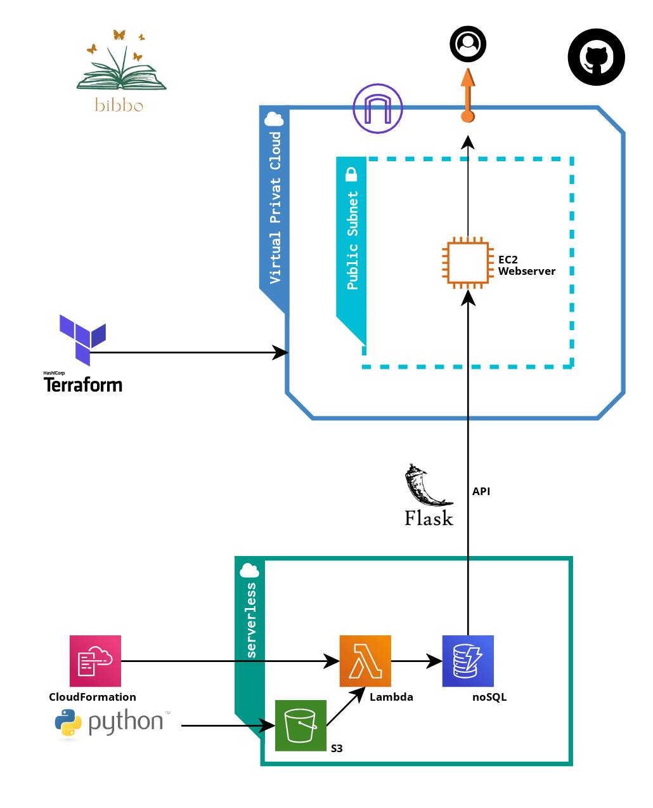

# Bibbo

bibbo is a use case for scientific libraries and reads files from the weekly "new release service" of Deutsche Nationalbibliothek and writes them into a database. Through generated API, filtered results are published to bibbo's website, hosted on an EC2 instance. Through bibbo, you will save time while browsing for new publications suiting your interests.

#
### Tech Talk

### Tools ☁
- Automated upload to S3
- Infrastructure as Code 
    - Amazon CloudFormation
    - Terraform
- Amazon DynamoDB (noSQL)
- Flask API
- Amazon Lambda 
- Amazon Cloudwatch
- Amazon VPC 
- HTML

#

#
bibbo is a service developed as capstone project at the end of a 12-weeks AWS re/Start Cloud Developer Bootcamp with [neuefische - School and Pool for Digital Talent](https://www.neuefische.de/).

