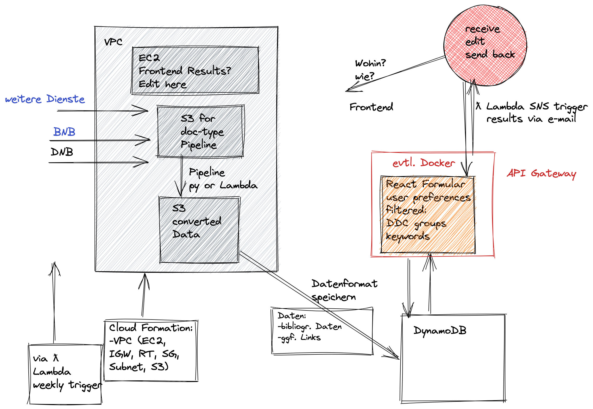

# Bibbo

🚧 Still under construction 🚧
#
### Tech Talk

### Tools ☁
- Automated Upload to S3
- Infrastructure as Code (Cloud Formation)
- DynamoDB
- React
- API Gateway
- AWS Lambda (trigger, sns, data converter)
- AWS Cloud Front
- Docker container orchastration 🐳
- Deployment via CI/CD Pipeline
- VPC with frontend for further editing

#

#
bibbo is a service developed as capstone project at the end of a 12-weeks AWS re/Start Cloud Developer Bootcamp with [neuefische - School and Pool for Digital Talent](https://www.neuefische.de/).

