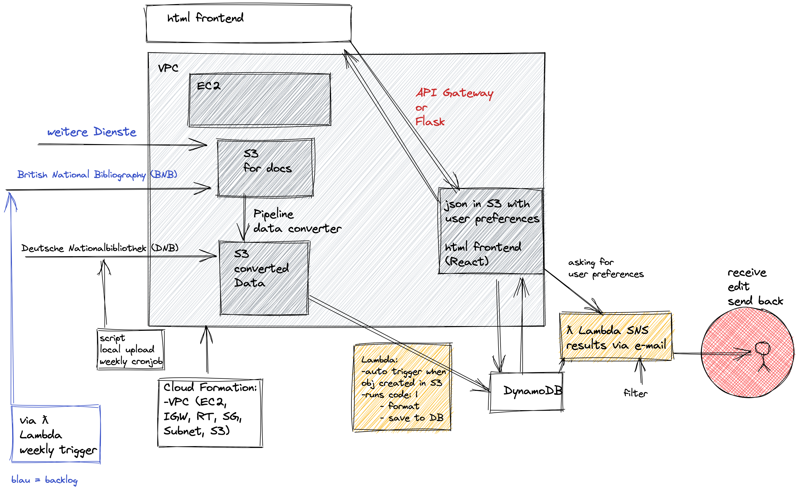

# Bibbo

🚧 Still under construction 🚧
#
### Tech Talk

### Tools ☁
- Automated Upload to S3
- Infrastructure as Code
- Database
- AWS Lambda
- AWS Cloud Front
- Docker container orchastration 🐳
- Deployment via CI/CD Pipeline
- VPC with accessible EC2 and S3, hosting a dashboard to send results to

#

#
bibbo is a service developed as capstone project at the end of a 12-weeks AWS re/Start Cloud Developer Bootcamp with [neuefische - School and Pool for Digital Talent](https://www.neuefische.de/).

